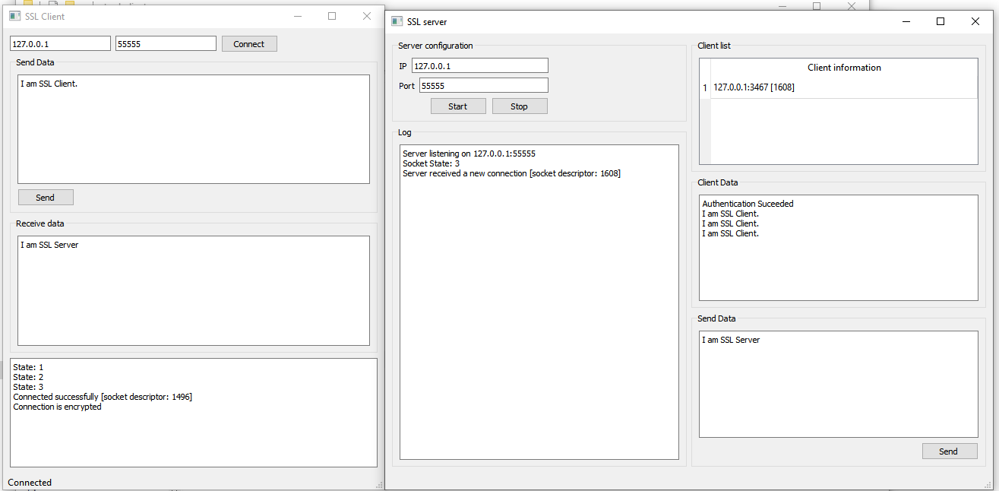

# Qt-SSL-Server-Client
SSL client and server with Qt

based on 
https://github.com/pavolmarak/qt_ssl_server
https://github.com/pavolmarak/qt_ssl_client

auto generation of X502 certificates soon
https://forum.qt.io/topic/45728/generating-cert-key-during-run-time-for-qsslsocket/6

